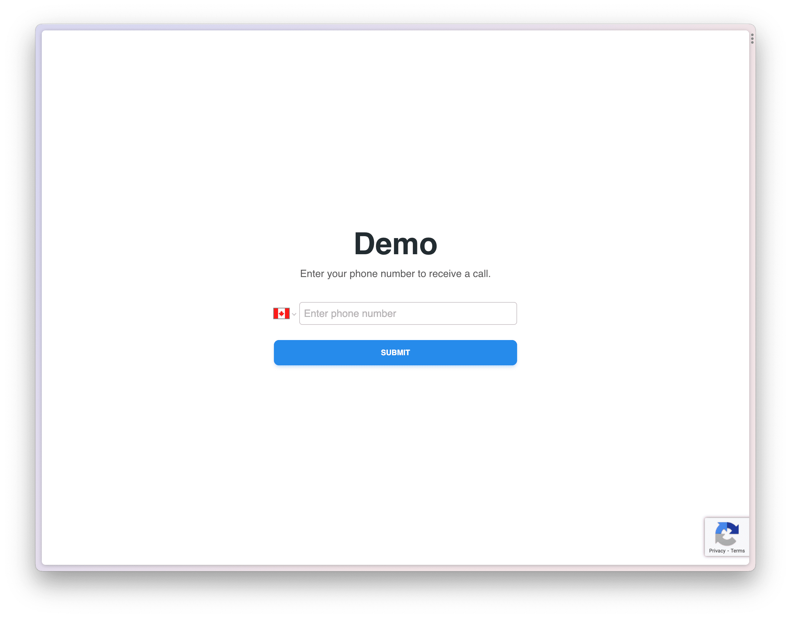

# Somleng Next.js Demo

This is a [Somleng](https://www.somleng.org) demo written in [Next.js](https://nextjs.org/). It takes an input for a recipient's phone number and uses the [Somleng Node.js helper library](https://github.com/somleng/somleng-node) to send a call to the recipient, executing the TwiML provided in the [configuration](#environment-variables).



## Getting Started

First, copy the example configuration:

`cp .env-example .env`

Then configure the environment variables as described below:

### Environment Variables

| Variable                       | Description                                                                                                          | Example                                        | Required |
|--------------------------------|----------------------------------------------------------------------------------------------------------------------|------------------------------------------------|----------|
| SOMLENG_ACCOUNT_SID            | Somleng Account SID                                                                                                  | change-me                                      | true     |
| SOMLENG_AUTH_TOKEN             | Somleng Auth Token                                                                                                   | change-me                                      | true     |
| FROM_PHONE_NUMBER              | A configured phone number from your Somleng account                                                                  | +85512345678                                   | true     |
| TWIML                          | A valid [TwiML](https://www.twilio.com/docs/voice/twiml) document to be executed when the recipient answers the call | `<Response><Say>Ahoy, World!</Say></Response>` | true     |
| RECAPTCHA_SECRET_KEY           | A [Google reCAPTCHA](https://www.google.com/recaptcha) secret key                                                    | change-me                                      | true     |
| NEXT_PUBLIC_RECAPTCHA_SITE_KEY | A [Google reCAPTCHA](https://www.google.com/recaptcha) site key                                                      | change-me                                      | true     |
| NEXT_PUBLIC_DEFAULT_COUNTRY    | Default country to be selected for the phone number input                                                            | CA                                             | true     |
| NEXT_PUBLIC_COUNTRIES          | A comma separated list of supported countries for the phone number input                                             | US,CA                                          | false    |

### Run the development server

```bash
npm run dev
# or
yarn dev
# or
pnpm dev
```

Open [http://localhost:3000](http://localhost:3000) with your browser to see the result.

## Deploy on Vercel

[](https://vercel.com/new/clone?repository-url=https%3A%2F%2Fgithub.com%2Fsomleng%2Fsomleng-demo-nextjs&env=NEXT_PUBLIC_RECAPTCHA_SITE_KEY,NEXT_PUBLIC_COUNTRIES,NEXT_PUBLIC_DEFAULT_COUNTRY,RECAPTCHA_SECRET_KEY,FROM_PHONE_NUMBER,SOMLENG_ACCOUNT_SID,SOMLENG_AUTH_TOKEN,TWIML&envDescription=API%20Keys%20for%20deployment&envLink=https%3A%2F%2Fgithub.com%2Fsomleng%2Fsomleng-demo-nextjs%23environment-variables)
